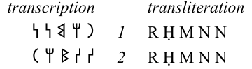

# About
The OSA Transcriber is a simple utility for transcribing and transliterating Old South Arabian texts written with the [Musnad script](https://en.wikipedia.org/wiki/Ancient_South_Arabian_script). Output is an SVG file, formatted as a table with transliteration on the left and transcription on the right, suitable for inclusion in other documents. This began as a way for me to present inscriptions in the text of my [PhD dissertation](https://www.academia.edu/39021541/The_Middle_Ḥaḍramūt_Archaeological_Survey_Settlement_Patterns_in_South_Arabia), which was written in LaTeX, but has been refined and reimagined as a standalone python utility.

# Usage
1. Launch the OSA Transcriber utility as one would any other python script ```python3 osa_transcriber.py```.
2. In the “Enter Codes” box input each line of text, using the codes shown in the table displayed in the program window, with a space separating each character code.
3. Left-to-right text is assumed by default, but lines can be reversed (as in boustrophedon texts) by starting them with a greater than (>) character.
4. Unsure or illegible characters are indicated by question marks. When a question mark immediately follows a character without a space between them, that character will be rendered inside of brackets in the output SVG file. Single and double question marks are rendered as indicated in the code table to show one or more illegible characters.
5. Large intentional gaps in the original text can be indicated with an underscore (_).
6. Note that no attempt yet has been made to render numerals with this utility.
7. When all codes for the text have been entered, click the “Transcribe” button to export the rendered SVG file.

# Examples
## Example 1: Graffiti from Wadi Hadramawt, Yemen
_Photograph of Example 1:_  


_Code Entry of Example 1:_  


_Output of Example 1:_  


[SVG of Example 1](examples/example1_output.svg)


## Example 2: Inscribed Block from AlUla, Saudi Arabia
_Photograph of Example 2:_  


_Code Entry of Example 2:_  


_Output of Example 2:_  


[SVG of Example 2](examples/example2_output.svg)


## Example 3: Boustrophedon of Line #2 of Example 1
_Code Entry of Example 3:_  


_Output of Example 3:_  


[SVG of Example 3](examples/example3_output.svg)
